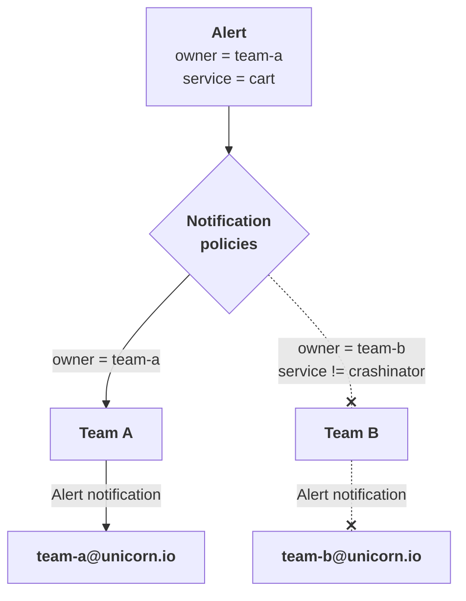

# Alerting configuration overview

The `AlertManager` manifest supported by DARK allows the definition and configuration of the following alerting components:

* Contact points: can be seen as a notification channel, or — more generally — a set of recipients for alerts
* Notification policies: set of "routing rules" indicating which contact point should receive a given alert

**Note:** silences and mute timings are NOT supported yet.

## Example usage

Let's consider the case of the *Unicorn company* and its two teams:

* `Team A` wants to receive alerts by email, only when they have the `owner` tag set to `team-a`
* `Team B` wants to receive alerts by email, only when they have the `owner` tag set to `team-b` and the service is not `crashinator`

To make sure no alerts falls through the cracks, `Team A` will also be the default contact point for alerts not matching these criterias.

The scenario we described can be represented visually as follows:



And it can be defined as code by applying the manifest:

```yaml
apiVersion: k8s.kevingomez.fr/v1alpha1
kind: AlertManager
metadata:
  name: alertmanager-example
spec:
  # Alerts not matched by any of the routing rules will be sent to this contact point
  default_contact_point: 'Team A'

  # List of known contact points
  contact_points:
    - name: Team A
      # How can we reach team A?
      contacts:
        - email: { to: ['team-a@unicorn.io'] }

    - name: Team B
      # How can we reach team B?
      contacts:
        - email: { to: ['team-b@unicorn.io'] }

  # Send specific alerts to chosen contact points, based on these routing rules:
  routing:
    - to: 'Team A'
      if_labels:
        - eq: { owner: team-a }

    - to: 'Team B'
      if_labels:
        - eq: { owner: team-b }
        - neq: { service: crashinator }
```

Check the result with:

```sh
kubectl get alertmanager
```

## Reference

```yaml
apiVersion: k8s.kevingomez.fr/v1alpha1
kind: AlertManager
metadata:
  name: alertmanager-example
spec:
  # Alerts not matched by any of the routing rules will be sent to this contact point.
  # Must match the name of one of the contact points defined below.
  # Required.
  default_contact_point: 'Contact point name'

  # Default list of labels to group alerts by.
  # Optional.
  default_group_by: [priority, service_name]

  # List of known contact points
  # Required.
  contact_points:
    - name: "Contact point name" # Required. Name of the contact point.
      # Contact point types: define actual methods of contact.
      # Optional. Default: []
      contacts:
        - email: { to: ['team-a@unicorn.io'] }

  # Send specific alerts to chosen contact points, based on these routing rules:
  # Required.
  routing:
    - to: 'Contact point name' # Required. Contact point name.
      # Matching rules. Only alerts matching these rules will be routed to the contact point.
      if_labels:
        - eq: { label_name: label_value, other_label: other_value } # Equality test ("=" operator). Optional.
        - neq: { label_name: label_value, other_label: other_value } # Difference test ("!=" operator). Optional.
        - matches: { label_name: "value_.*" } # Regex test ("=~" operator). Optional.
        - not_matches: { label_name: "value_.*" } # Does not match regex test ("!=~" operator). Optional.
```

## That was it!

[Return to the index to explore what you can do with DARK](../index.md)